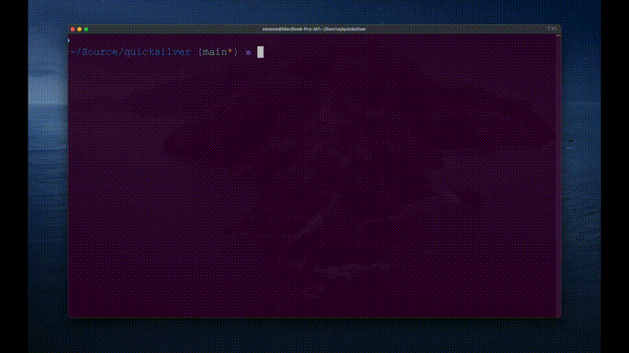
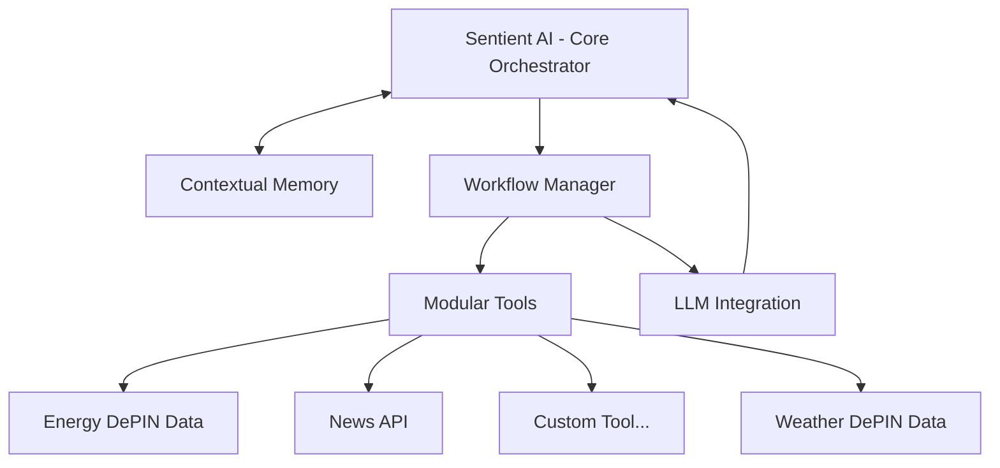

# Quicksilver: Sentient AI Framework

[](https://www.typescriptlang.org/)
[](LICENSE)
[](https://github.com/raullenchai/quicksilver/commits/main)
[](https://github.com/raullenchai/quicksilver/stargazers)
[](https://github.com/raullenchai/quicksilver/network/members)

**Quicksilver** is an open-source framework that bridges the capabilities of **Large Language Models (LLMs)** with **Decentralized Physical Infrastructure Networks (DePINs)** to create **advanced AI agents**.

>By leveraging DePINs as the "_sensorial component_", Quicksilver enables AI agents to interact with the physical world, gather real-time data, and respond contextually.

<details>
  <summary>Read more</summary>
The QuickSilver framework empowers developers to build intelligent agents that:

- **Sense and Understand**: Use DePINs to collect and process data from decentralized physical infrastructure, acting as the sensory layer for AI agents.
- **Act and Respond**: Combine LLMs' advanced reasoning capabilities with data from DePINs to perform context-aware interactions.
- **Integrate Seamlessly**: Utilize the framework's modularity to connect with multiple DePIN projects, including weather, energy, and location networks, enabling agents to access diverse sources of decentralized data.
- **Orchestrate Workflows**: Automate multi-step processes while maintaining state and context.

</details>

---



## Features

- **Workflow Orchestration**: Executes complex, multi-step tasks orchestrating interaction between LLM, tools, and memory.
- **LLM Integration**: Suports popular LLMs like OpenAI, Gemini, etc... to understand and generate human-like text.
- **Contextual Memory**: Maintains state and context across conversations.
- **Built in Tools**: Built-in tools for computing, interacting with DePIN projects and other APIs (e.g., weather and energy data, news services, and more).
- **Modular Architecture**: Easily extendable with new tools and workflows.

---

## Architecture

Quicksilver's architecture is modular and extensible, enabling developers to customize it for various use cases.



### Key Components

1. **Sentient AI (Core Orchestrator)**: Central hub managing interactions and delegating tasks.
2. **Contextual Memory**: Tracks user interactions and maintains context for continuity.
3. **Workflow Manager**: Handles task automation and orchestration.
4. **Modular Tools**: Extensible modues for interacting with different DePINs.
5. **LLM Integration**: Interfaces with language models for intelligent responses.

---

## Getting Started

### Prerequisites
- [Node.js](https://nodejs.org/) (v16 or later)
- [npm](https://www.npmjs.com/) or [yarn](https://yarnpkg.com/)
- Docker (optional, for containerized environments)

### Installation

1. Clone the repository:

   ```bash
   git clone https://github.com/iotexproject/quicksilver.git
   cd quicksilver
   ```

2. Install dependencies:

   ```bash
   npm install
   ```

3. Create a `.env` file based on `.env.template`:

   ```env
    OPENAI_API_KEY=your_openai_api_key
    NUBILA_API_KEY=your_nubila_api_key
    NEWSAPI_API_KEY=your_newsapi_api_key
   ```

4. Run example agents:

Some example agents are located in the `example` folder. Run an example with:
  
   ```bash
   npx ts-node example/demo_agent.ts
   ```

---


## What's next?

Quicksilver is just getting started, and there’s immense potential for growth. We’re inviting contributors to join us in building the future of AI agents and DePIN integration. Here are some areas where you can make a difference:

- **Integrate DePIN network**: Be part of Quicksilver’s core vision by researching and integrating a Decentralized Physical Infrastructure Network (DePIN). This is an opportunity to demonstrate how DePINs can act as the “sensorial” layer for AI agents.
  
- **Implement advanced memory types**: Help Quicksilver remember more effectively! Experiment with innovative memory systems like conversation buffers or vector databases to enhance context retention and agent intelligence.
  
- **Develop custom tools**: Bring your creativity to life by building tools for new functionalities, such as calendar access, task management, or data analysis. Your contributions can significantly expand the agent’s utility.
  
- **Enhance workflow logic**: Improve the agent’s decision-making capabilities to make better use of the tools and resources available. Collaborate to create smarter, more adaptable workflows.

Have an idea outside of this list? We’d love to hear it!

## Contributing

We welcome contributions! To contribute:
1. Fork the repository.
2. Create a new branch:
   ```bash
   git checkout -b feature-name
   ```
3. Make your changes and test thoroughly.
4. Submit a pull request with a detailed description.

---

## License

This project is licensed under the MIT License. See [LICENSE](LICENSE) for more information.
