# Quicksilver: Sentient AI Framework

[](https://www.typescriptlang.org/)
[](LICENSE)
[](https://github.com/raullenchai/quicksilver/commits/main)
[](https://github.com/raullenchai/quicksilver/stargazers)
[](https://github.com/raullenchai/quicksilver/network/members)

**Quicksilver** is an open-source framework that bridges the capabilities of **Large Language Models (LLMs)** with **Decentralized Physical Infrastructure Networks (DePINs)** to create **advanced AI agents**.

> By leveraging DePINs as the "_sensorial component_", Quicksilver enables AI agents to interact with the physical world, gather real-time data, and respond contextually.

<details>
  <summary>Read more</summary>
The QuickSilver framework empowers developers to build intelligent agents that:

- **Sense and Understand**: Use DePINs to collect and process data from decentralized physical infrastructure, acting as the sensory layer for AI agents.
- **Act and Respond**: Combine LLMs' advanced reasoning capabilities with data from DePINs to perform context-aware interactions.
- **Integrate Seamlessly**: Utilize the framework's modularity to connect with multiple DePIN projects, including weather, energy, and location networks, enabling agents to access diverse sources of decentralized data.
- **Orchestrate Workflows**: Automate multi-step processes while maintaining state and context.

</details>

---


## Features

- **Workflow Orchestration**: Executes complex, multi-step tasks orchestrating interaction between LLM, tools, and memory.
- **LLM Integration**: Suports popular LLM providers like OpenAI, Anthropic, DeepSeek, etc... to understand and generate human-like text.
- **Contextual Memory**: Maintains state and context across conversations.
- **Built in Tools**: Built-in tools for computing, interacting with DePIN projects and other APIs (e.g., weather and energy data, news services, and more).
- **Modular Architecture**: Easily extendable with new tools and workflows.

---

## Architecture

Quicksilver's architecture is modular and extensible, enabling developers to customize it for various use cases.

```mermaid
graph TD
    User[👤 User]
    User --> |How has the recent heat wave in Texas affected energy prices and Bitcoin mining operations?| SocialClients[💬 Social Media Clients<br/>Discord, Telegram, X]

    subgraph ElizoOS Stack
        SocialClients --> BinoAI[🧠 BinoAI]
    end

    BinoAI -->|Requests Real-World Data| QS

    subgraph QS[⚡ Quicksilver System]
        Orchestrator[🎼 Orchestrator] --> Finance[💰 Finance]
        Finance --> Orchestrator

        Orchestrator --> Blockchain[⛓️ Blockchain]
        Blockchain --> Orchestrator

        Orchestrator --> Climate[🌍 Climate & Environment]
        Climate --> Orchestrator

        Orchestrator --> Navigation[🧭 Navigation]
        Navigation --> Orchestrator

        Orchestrator --> Media[📰 Media Intelligence]
        Media --> Orchestrator
    end

    ThirdParty[🧩 Third-Party Tools<br/>ThirdWeb, Messari Copilot, DeFiLlama,<br/>CoinMarketCap, DePINNinja, Nebula API, etc.]

    Finance --> ThirdParty
    Blockchain --> ThirdParty
    Climate --> ThirdParty
    Navigation --> ThirdParty
    Media --> ThirdParty
```



### Key Components

1. **Sentient AI (Core Orchestrator)**: Central hub managing interactions and delegating tasks.
2. **Contextual Memory**: Tracks user interactions and maintains context for continuity.
3. **Workflow Manager**: Handles task automation and orchestration.
4. **Modular Tools**: Extensible modues for interacting with different DePINs.
5. **LLM Integration**: Interfaces with language models for intelligent responses.

---

## Getting Started

### Prerequisites

- [Node.js](https://nodejs.org/) (v22)
- [bun](https://bun.sh/)
- Docker (optional, for containerized environments)

### Installation

1. Clone the repository:

   ```bash
   git clone https://github.com/iotexproject/quicksilver.git
   cd quicksilver
   ```

2. Install dependencies:

   ```bash
   bun i
   ```

3. Create a `.env` file based on `.env.template`:

   ```env
    OPENAI_API_KEY=your_openai_api_key
    NUBILA_API_KEY=your_nubila_api_key
    NEWSAPI_API_KEY=your_newsapi_api_key
    # Other API keys...
   ```

4. Run example agents:

Some example agents are located in the `example` folder. Run an example with:

```bash
bun run example/demo_agent.ts
```

5. Run the server:

   ```bash
   bun run start
   ```

6. Test API query:

   ```bash
    curl http://localhost:8000/ask -X POST -H "Content-Type: application/json" -d '{"q": "What is the weather in San Francisco?"}'
   ```

7. Access raw tool data:

   ```bash
   # Get raw weather data for San Francisco
   curl "http://localhost:8000/raw?tool=weather-current&lat=37.7749&lon=-122.4194"

   # Get raw news data
   curl "http://localhost:8000/raw?tool=news"

   # Get raw DePIN metrics
   curl "http://localhost:8000/raw?tool=depin-metrics&isLatest=true"
   ```

The `/raw` endpoint allows direct access to tool data without LLM processing. This is useful for:

- Debugging tool responses
- Building custom integrations
- Reducing API costs by skipping LLM processing
- Accessing structured data formats
- Context providing for agents

Available tools and their parameters:
| Tool | Parameters | Description |
|------|------------|-------------|
| `weather-current` | `lat`, `lon` | Current weather data |
| `weather-forecast` | `lat`, `lon` | Weather forecast |
| `news` | none | Latest news headlines |
| `depin-metrics` | `isLatest` | DePIN network metrics |
| `depin-projects` | none | DePIN project data |
| `l1data` | none | L1 blockchain statistics |
| `nuclear` | `start`, `end` | Nuclear outage data |
---

## What's next?

Quicksilver is just getting started, and there's immense potential for growth. We're inviting contributors to join us in building the future of AI agents and DePIN integration. Here are some areas where you can make a difference:

- **Integrate DePIN network**: Be part of Quicksilver’s core vision by researching and integrating a Decentralized Physical Infrastructure Network (DePIN). This is an opportunity to demonstrate how DePINs can act as the “sensorial” layer for AI agents.
- **Implement advanced memory types**: Help Quicksilver remember more effectively! Experiment with innovative memory systems like conversation buffers or vector databases to enhance context retention and agent intelligence.
- **Develop custom tools**: Bring your creativity to life by building tools for new functionalities, such as calendar access, task management, or data analysis. Your contributions can significantly expand the agent’s utility.
- **Enhance workflow logic**: Improve the agent’s decision-making capabilities to make better use of the tools and resources available. Collaborate to create smarter, more adaptable workflows.

Have an idea outside of this list? We'd love to hear it!

## Quicksilver works with Eliza

Quicksilver is serving the sentient AI queries as the DePIN-Plugin on [Eliza](https://github.com/elizaOS/eliza). You can simply enable the plugin and start using it. With Quicksilver, your Eliza agent will gain sentient-like capabilities to interact intelligently with the world. The current capabilities are listed above. If you like to add more capabilities, please refer to the [Contributing](#contributing) section.

## LLM Provider Configuration

Quicksilver supports multiple LLM providers and uses a dual-LLM architecture with a fast LLM for initial processing and a primary LLM for complex reasoning. Configure your providers in the `.env` file:

```env
# LLM Provider
FAST_LLM_PROVIDER=openai
LLM_PROVIDER=deepseek

# LLM Provider API Keys
OPENAI_API_KEY=your_openai_api_key
ANTHROPIC_API_KEY=your_anthropic_api_key
DEEPSEEK_API_KEY=your_deepseek_api_key

# LLM Model Selection
FAST_LLM_MODEL=gpt-4o-mini    # Model for fast processing
LLM_MODEL=deepseek-chat       # Model for primary reasoning
```

### Supported Providers

- **OpenAI**: Use OpenAI's models by setting the provider to `openai`
  - Default model: `gpt-4o-mini`
- **Anthropic**: Use Claude models by setting the provider to `anthropic`
  - Default model: `claude-3-5-haiku-latest`
- **DeepSeek**: Use DeepSeek's models by setting the provider to `deepseek`
  - Default model: `deepseek-chat`
  - Note: DeepSeek uses OpenAI-compatible API endpoints

## Managing Multiple Instances

Quicksilver supports running multiple instances with different tool configurations. This is useful when you want to:

- Run specialized instances for different use cases
- Isolate tool sets for different environments
- Manage resource usage by enabling only necessary tools
- Test different tool combinations

### Configuration Structure

```bash
configs/ # Your instance-specific configuration (gitignored) 
    ├── .env.weather # Instance with only weather-related tools
    ├── .env.news    # Instance with news and analytics tools
    └── .env.full    # Instance with all tools enabled
```

### Creating a New Instance

1. Copy the template configuration:

```bash
cp .env.template configs/.env.myinstance
```

2. Edit the configuration file:

```env
# configs/.env.myinstance

# Enable only required tools
ENABLED_TOOLS=weather-current,weather-forecast,news

# Configure instance-specific API keys
NUBILA_API_KEY=your_key
NEWSAPI_API_KEY=your_key

# Other configuration...
PORT=8001
```

3. Update the docker-compose.yml file to use the new instance:

```yaml
services:
  instance1:
    # image: ghcr.io/iotexproject/quicksilver:latest (uncomment if you want to use the latest official image)
    env_file: configs/.env.myinstance
    ports:
      - '33333:3000'
      - '8001:8000'
    restart: always
```

### Running Instances

Using Docker Compose:

```bash
# Start a specific instance
docker compose up instance1

# Run multiple instances
docker compose up
```

Using environment files directly:

```bash
# Start with specific config
bun run start --env-file configs/instances/weather.env

# Or using environment variable
CONFIG_PATH=configs/instances/weather.env bun run start
```

### Example Configurations

1. Weather-focused Instance:

```env
# configs/instances/weather.env
ENABLED_TOOLS=weather-current,weather-forecast
NUBILA_API_KEY=your_key
PORT=8001
```

2. News and Analytics Instance:

```env
# configs/instances/news.env
ENABLED_TOOLS=news,depin-metrics,depin-projects
NEWSAPI_API_KEY=your_key
DEPIN_API_KEY=your_key
PORT=8002
```

3. IoT Data Instance:

```env
# configs/instances/iot.env
ENABLED_TOOLS=dimo,l1data
CLIENT_ID=your_client_id
REDIRECT_URI=your_uri
API_KEY=your_key
PORT=8003
```


### Available Tools

The following tools can be enabled in your configuration:

| Tool Name          | Description           | Required Environment Variables         |
| ------------------ | --------------------- | -------------------------------------- |
| `news`             | News API integration  | `NEWSAPI_API_KEY`                      |
| `weather-current`  | Current weather data  | `NUBILA_API_KEY`                       |
| `weather-forecast` | Weather forecasts     | `NUBILA_API_KEY`                       |
| `depin-metrics`    | DePIN network metrics | `DEPIN_API_KEY`                        |
| `depin-projects`   | DePIN project data    | `DEPIN_API_KEY`                        |
| `l1data`           | L1 blockchain data    | `API_V2_KEY`                          |
| `dimo`             | Vehicle IoT data      | `CLIENT_ID`, `REDIRECT_URI`, `API_KEY` |
| `nuclear`          | Nuclear outage data   | `EIA_API_KEY`                          |
| `mapbox`           | Mapbox API integration | `MAPBOX_ACCESS_TOKEN`                  |
| `messari`          | Messari API integration | `MESSARI_API_KEY`                     |
| `thirdweb`         | Thirdweb API integration | `THIRDWEB_SECRET_KEY`, `THIRDWEB_SESSION_ID` |
| `cmc`              | CoinMarketCap API integration | `CMC_API_KEY`                          |
| `airquality`       | Air quality data      | `AIRVISUAL_API_KEY`                   |
| `depinninja`       | Depin Ninja API integration | `DEPINNINJA_API_KEY`                  |


### Best Practices

1. **Configuration Management**:

   - Keep sensitive data out of version control
   - Use descriptive names for config files
   - Document required environment variables

2. **Resource Optimization**:

   - Enable only necessary tools per instance
   - Monitor resource usage
   - Use appropriate container resources

3. **Deployment**:

   - Use different ports for different instances
   - Set up health checks
   - Implement proper logging

4. **Security**:
   - Don't commit API keys
   - Use separate API keys per instance
   - Implement rate limiting

## Contributing

We welcome contributions! To contribute:

1. Fork the repository.
2. Create a new branch:
   ```bash
   git checkout -b feature-name
   ```
3. Make your changes and test thoroughly.
4. Submit a pull request with a detailed description.

---

## License

This project is licensed under the MIT License. See [LICENSE](LICENSE) for more information.
